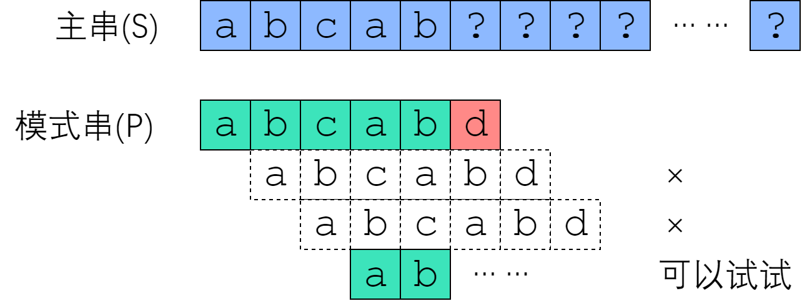

# 简单的模式匹配算法  
> 思路：暴力匹配，用子串T的第一位去跟主串S的每一位进行比对，如果相等，则比对下一位；如果不等，则子串T复位到第一位，主串S复位到第一次匹配成功位置的下一个字符，再进行比对。  
> 最坏时间复杂度：**O(mn)**，mn分别为主串子串长度
```cpp
int Index(SString S, SString T){
    int i=1, j=1;
    while(i<=S.length() && j<=T.length()){
        if(S.ch[i] == T.ch[j]){ //如果匹配就继续匹配后续字符
            ++i;
            ++j;
        }
        else{
            i = i-j+2; //指针后退重新开始分配
            j=1;
        }
    }
    if(j>T.length()) return i-T.length();
    else return 0;
}
```  
> 示例:  
$[](批注%202020-07-10%20160539.png)  
# KMP算法  
## 普通算法的缺点和对此的改进
普通算法的缺点在于主串的每一个元素都进行了比对，然而这不必要。假设一个主串S和子串T部分匹配，实际上其中隐含了信息可以使用。例如主串S和子串T，在S的i处，T的j处失配，那么就从i处向前看，同时从T开头看，看二者最大的相同长度到哪，就说明，对S来说，这段长度之前的元素肯定是没有办法匹配成功的。那就移动子串T，使得这两段长度对齐，并从这段结束的地方重新开始比对。  

  
以上图为例，把子串右移一位、两位的操作是没有必要的，从已经匹配的信息来看，肯定会失败。最有可能成功的匹配是把子串右移三位，因为这是子串和主串重新开始相等的地方。  
   
那么随之而来的是，如何计算右移的大小和对齐之后从哪里开始重新匹配即重复串的长度。  

## 引入部分匹配值、PM表、next数组  
前缀：除最后一个字符外，字符串的全部头部子串  
后缀：出第一个字符外，字符串的全部尾部子串  
部分匹配值：字符串的前缀和后缀的最长相等长度
> 以`'ababa'`为例：  
> | 字符串 | 前缀 | 后缀 | 最长相等串 | 最长相等长度 |
> | :---: | :-----: | :-----: | :-: |:---: |
> |`'a'` | 空 | 空 | 空 | 0 |
> |`'ab'` | {a} | {b} | 空 | 0 |
> |`'aba'` | {a, ab} | {a, ba} | {a} | 1 |
> |`'abab'` | {a, ab, aba} | {b, ab, bab} | {ab} | 2 |
> |`'ababa'` | {a, ab, aba, abab} | {a, ba, aba, baba} | {aba} | 3 |
把最长相等长度列成表，即得PM表
> | 编号 | S | PM |
> | :-: | :-: | :-: |
> | 1 | a | 0|
> | 2 | ab | 0|
> | 3 | aba | 1|
> | 4 | abab | 2|
> | 5 | ababa | 3|    

最长相等长度即为部分匹配值，那么可得公式`移动位数 = 已经匹配的字符数 - 部分匹配值`

PM表在使用过程中有较多不便，因为主串在i处失配时，取用的是i-1的PM值，那么把PM表整体右移一位，首位补-1，末位溢出，称为next数组  

此时，我们已经知道了子串该右移几位（移动位数），并且知道了要把子串T的指针指向哪里开始重新匹配（`T[next[j]+1]`）。  

## 机器求解next数组与KMP算法代码  
```cpp
void get_next(String T, int next[]){
    int i=1, j=0;
    next[1]=0;
    while(i<T.length()){
        if(j == 0||T.ch[i] == T.ch[j]){
            ++i;
            ++j;
            next[i]=j;
        }
        else{
            j = next[j]+1;
        }
    }
}
```  
求next数组的过程完全可以看成字符串匹配的过程，即以模式字符串为主字符串，以模式字符串的前缀为目标字符串，一旦字符串匹配成功，那么当前的next值就是匹配成功的字符串的长度。
```cpp
int KMP(char * t, char * p) 
{
	int i = 0; 
	int j = 0;

	while (i < strlen(t) && j < strlen(p))
	{
		if (j == -1 || t[i] == p[j]) 
		{
			i++;
           		j++;
		}
	 	else 
           		j = next[j];
    	}

    if (j == strlen(p))
       return i - j;
    else 
       return -1;
}
```  
**KMP算法的时间复杂度为：O(m+n)**  
# 修正的KMP算法  
> 以上定义的next数组在某些情况下会产生错误，此时需要进行修正  
> 
> 当模式串匹配过程中出现了`T_j=T_next(j)`时，要把`next[j]`修正为`next[next[j]]`，直到二者不相等为止，更新后的数组命名为nextval  
```cpp
void get_nextval(String T, int nextval[]){
    int i=1, j=0;
    nextval[1]=0;
    while(i<.T.length()){
        if(j==0||T.ch[i]==T.ch[j]){
            ++j;
            ++i;
            if(T.ch[i]!=T.ch[j])
                nextval[i]=j;
            else
                nextval[i]=nextval[j]
        }
        else{
            j=nextval[j];
        }
    }
}
```
