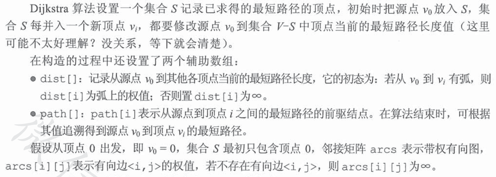
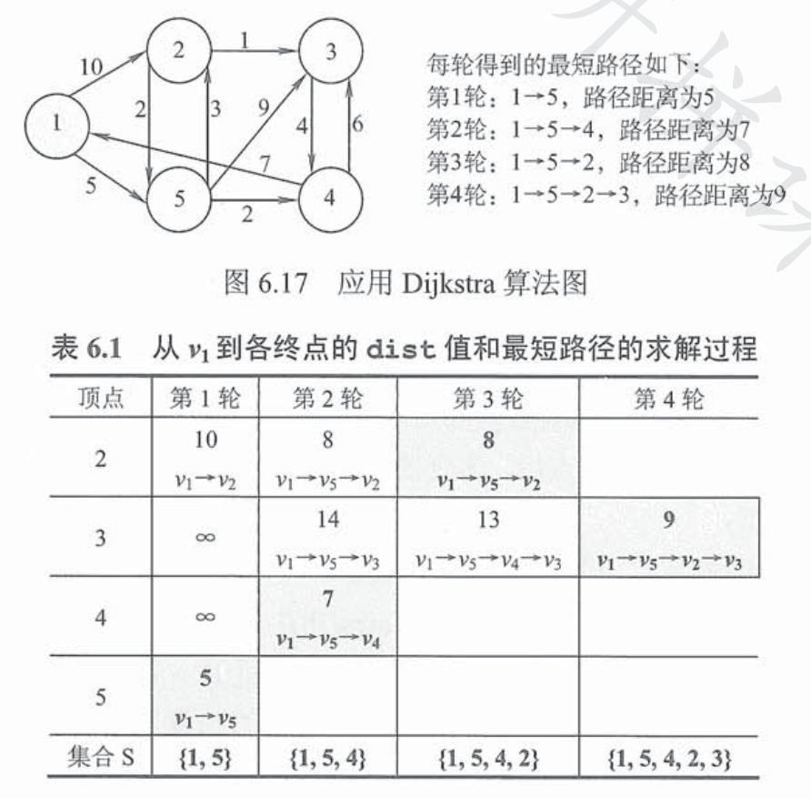
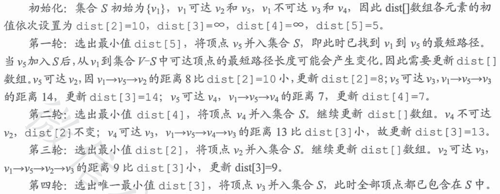
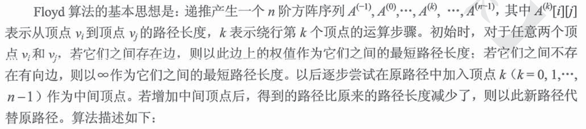
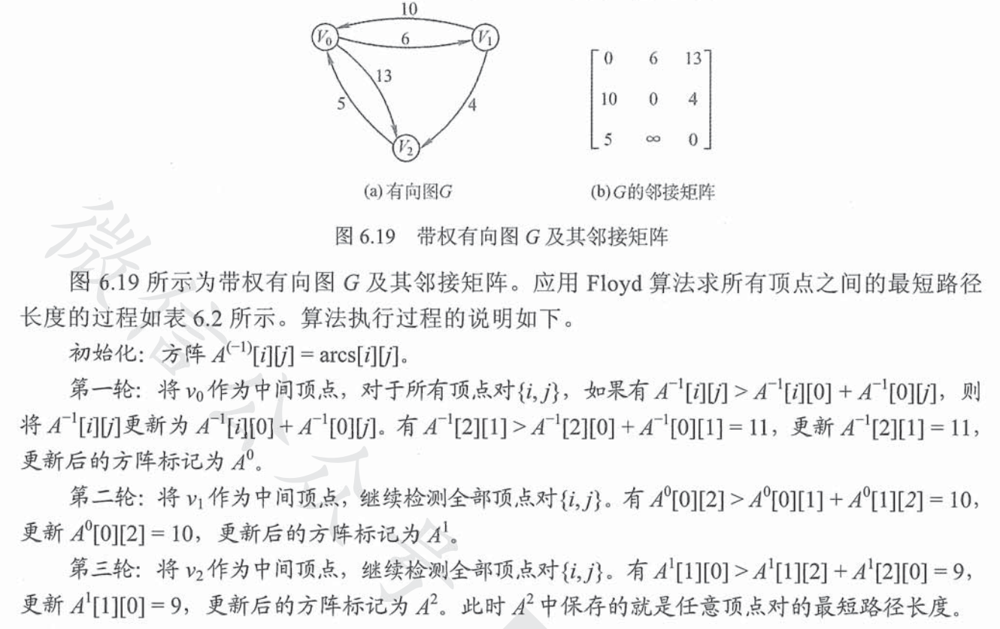
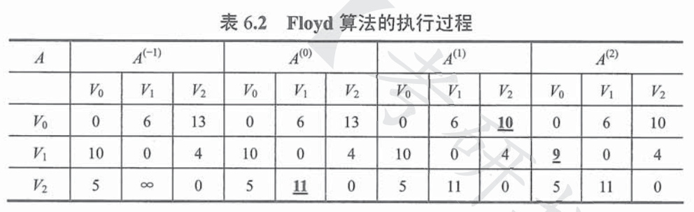
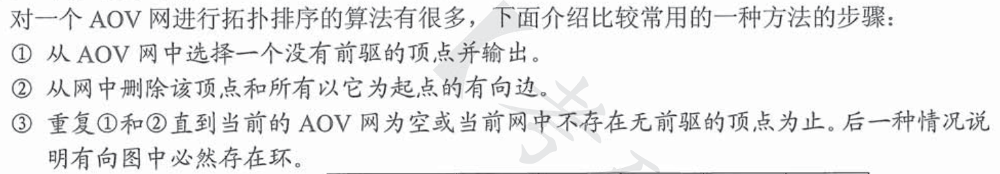
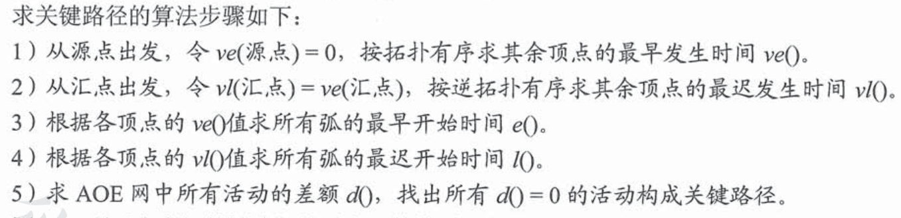
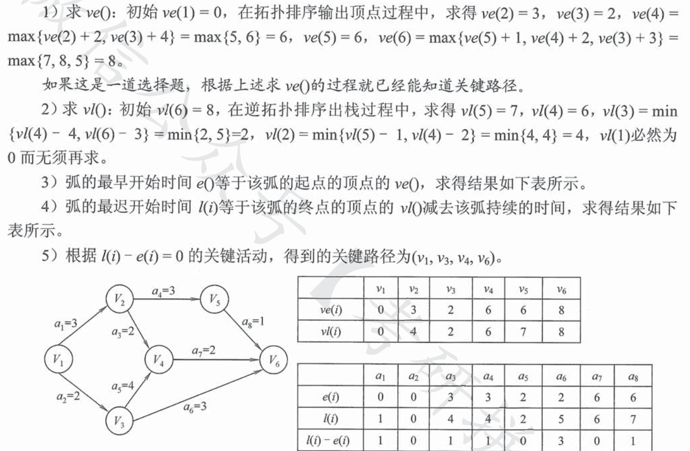

# 最小生成树
## 普利姆算法
原图：  

以上图G4为例，来对普里姆进行演示(从第一个顶点A开始通过普里姆算法生成最小生成树)。  

初始状态：V是所有顶点的集合，即V={A,B,C,D,E,F,G}；U和T都是空！ 

- 第1步：将顶点A加入到U中。   
    此时，U={A}。   

- 第2步：将顶点B加入到U中。   
    上一步操作之后，U={A}, V-U={B,C,D,E,F,G}；  
    因此，边(A,B)的权值最小。将顶点B添加到U中；此时，U={A,B}。   

- 第3步：将顶点F加入到U中。   
    上一步操作之后，U={A,B}, V-U={C,D,E,F,G}；  
    因此，边(B,F)的权值最小。将顶点F添加到U中；此时，U={A,B,F}。   

- 第4步：将顶点E加入到U中。   
    上一步操作之后，U={A,B,F}, V-U={C,D,E,G}；  
    因此，边(F,E)的权值最小。将顶点E添加到U中；此时，U={A,B,F,E}。   

- 第5步：将顶点D加入到U中。   
    上一步操作之后，U={A,B,F,E}, V-U={C,D,G}；  
    因此，边(E,D)的权值最小。将顶点D添加到U中；此时，U={A,B,F,E,D}。   

- 第6步：将顶点C加入到U中。    
    上一步操作之后，U={A,B,F,E,D}, V-U={C,G}；  
    因此，边(D,C)的权值最小。将顶点C添加到U中；此时，U={A,B,F,E,D,C}。   

- 第7步：将顶点G加入到U中。   
    上一步操作之后，U={A,B,F,E,D,C}, V-U={G}；  
    因此，边(E,G)的权值最小。将顶点G添加到U中；此时，U=V。  

此时，最小生成树构造完成！它包括的顶点依次是：A B F E D C G。  
> 注意每一次从U和V集合中选一个权值最小的边，对应的顶点加入U中，直到V中没有元素  

## 克鲁斯卡尔算法
算法思想：
1. 将所有边的边权从小到大依次排列，并且均标为未选；
2. 选择最小的未选边；
3. 如果该边与前面所选的边无法构成回路，则选中该边，并标为已选；如果该边与前面所选的边构成了回路，则不选该边，并标为已选；
4. 重复（2）（3），直到所有点之间都有边相连；  
> 过程容易理解，只需要注意选边的时候不能成环，如果有成环则跳过该边；

# 最短路径
## 迪杰斯特拉算法
> 求解**带权有向图G中**某一顶点到其他各个顶点的最短路径  

- 概述：

- 实例：

> 结合实例容易理解算法过程，需要注意的是初始化和算法每一次前进一步都需要更新当前到未确定的各个顶点的最短距离，这是因为可能存在拐弯之后的权值相加仍小于原值的情况。  
> 
> 注意算法只能求解**权值为正数**的带权有向图

## 弗洛伊德算法  
- 算法思想：  
  
- 实例：

  

# 拓扑排序  
- AOV网：有向无环图，边的指向代表了事件发生的前后顺序  
- 拓扑排序：将AOV网以一个一维序列形式表达，这个序列满足
  - 每个顶点出现且仅出现一次
  - 若A排在B前面，则在AOV网中不存在B到A的路径，即A必须先于B发生
- 算法： 
  

# 关键路径  
- AOE网：在AOV网的基础上，添加了边权值，代表了完成活动的开销（需要的时间等）  
- 关键路径：从源点到汇点的所有路径中，具有最大路径长度的路径称为关键路径，关键路径上的活动称为关键活动   
  
1. 事件$v_k$发生的最早发生时间ve(k):  
   指从源点到任意顶点k的最长路径长度，决定了从k开始的活动能够开工的最早时间  

2. 时间$v_k$的最迟发生时间vl(k):  
   指不推迟整个工程完成的前提下，即保证其后继事件j在它的最迟发生时间vl(j)之前能够发生时，该事件最迟必须发生的时间。
3. 活动$a_i$最早开始时间e(i)  
   弧起点所指代的事件的最早发生时间  
4. 活动$a_i$最迟开始时间l(i)  
   弧终点所指代的事件的最迟发生时间与该活动所需时间之差  
5. 活动的最迟开始时间和最早开始时间的差额   

- 求关键路径算法  
  
- 实例
  
  在选择题中可以省略步骤，但是解答题必须写完全部步骤