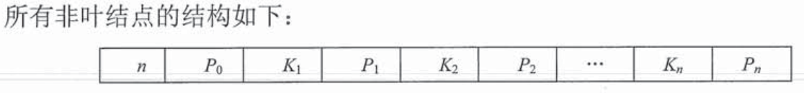
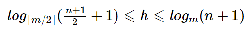

# 顺序查找和折半查找
## 顺序查找  
1. 一般线性表顺序查找   
   $$ASL_{成功}=\sum_{i=1}^{n}P_i(n-i+1)=\frac{n+1}{2}$$  
   $$ASL_{失败}=n+1$$  
2. 有序表顺序查找    
   $$ASL_{成功}=\sum_{i=1}^{n}P_i(n-i+1)=\frac{n+1}{2}$$  
   $$ASL_{失败}=\frac{1+2+\cdots+n+n}{n+1}=\frac{n}{2}+\frac{n}{n+1}$$  
   > 有序表在查找失败时的性能优于一般线性表顺序查找   
## 折半查找  
```cpp
int Binary_Search(SeqList L, ElemType key){
    int low=0, high=L.TableLen-1, mid;
    while(low<=high){
        mid=(low+high)/2;
        if(L.elem[mid]==key){
            return mid;
        }
        else if(L.elem[mid]>key){
            high=mid-1;
        }
        else{
            low=mid+1;
        }
    }
    return -1;
}
```   
$$ASL_{成功}=\frac{n+1}{n}log_2(n+1)-1\approx log_2(n+1)-1$$  
> 仅适用于有随机存储性质的、关键字按序排列的线性表  

## 分块查找  
将查找表分为若干子块，块内元素可以无序，但块间有序———第一个块的最大关键字小于第二个块的最小关键字……；再建立一个索引表，其中含有各块的最大关键字和各块的第一个元素地址，索引表按关键字有序排列  
$$ASL=\frac{s^2+2s+n}{2s} \text{ 其中，查找表长度为n，均分为b块，每块有s个记录}$$   

# B树和B+树  
## B树  
1. 概念  
   - B树是一棵m叉树  
   - 为了保证查找效率，尽量减少树高，规定除根结点之外的非叶结点最少有$\left \lceil m/2 \right \rceil$个子树，即每个结点最少含有$\left \lceil m/2 \right \rceil-1$个关键字
   - p0所指向的子树中，所有关键字都小于k1；p1所指向的子树中，所有关键字都大于k1
2. 高度
   - 对包含n个关键字，高度为h，阶数为m的B树：
   - 高度范围 
        
3. 插入  
   对B树进行插入操作
   1. 定位：利用查找算法，假设查找要插入的key，则会查找到一个失败结点；继而可以定位到上面的终端结点中要插入的位置。
   2. 插入：有两种情况
      - 插入后的终端结点的结点个数符合要求，直接插入
      - 插入后的结点个数多于m-1，则要分裂该节点；以$\left \lceil m/2 \right \rceil$为中，并把该元素提高到父节点位置，左右半边成为新的子树
4. 删除 
   删除节点涉及到合并结点
   - 删除一个非终端结点中的元素：用该元素的前驱/后继覆盖该元素，接着在终端结点删除前驱/后继元素
   - 删除一个终端结点中的元素：
     - 若删除后结点元素个数仍大于$\left \lceil m/2 \right \rceil$，则直接删除
     - 若删除后结点元素个数不符合最小要求，则向其左右兄弟借
       - 若够借：用前驱、前驱的前驱来代替，或是后继、后继的后继来代替
       - 不够借：合并左右兄弟和父节点，重新排列组合
## B+树  
1. 概念：
   - 根结点至少有两个子树，其他节点最少有$\left \lceil m/2 \right \rceil$个子树
   - 节点的子树个数等于关键字的个数
   - 只有叶结点有关键字及对应记录的地址，非叶结点只有其子树中的最大关键字和对应的子树地址  
2. 与B树的差异
   - B树m个关键字对应了m+1个子树；B+树m个关键字对应了m个子树  
   - B+树节点关键字个数范围 $\left \lceil m/2 \right \rceil \leq n \leq m$ ；B树范围$\left \lceil m/2 \right \rceil -1 \leq m-1$
   - B树节点包含了关键字和关键字指向的记录的地址；B+树只在叶结点包含了记录的地址，非叶结点只有索引的作用  

# 散列查找  
## 散列函数
1. 直接定址法
   - H(key)=key / H(key)=a*key+b
2. 除留余数法
   - H(key)=key%p 
   - p是一个不大于且最接近散列表长的质数
3. 数字分析法
4. 平方取中法 

## 处理地址冲突
### 开放定址法
$$ H_i=(H(key)+d_i)%m $$  
$H_i$表示第i次冲突后的新地址，$d_i$表示增量序列
- 确定增量序列
  1. 线性探测法
       - $d_i=0,1\cdots$
  2. 平方探测法
        - $d_i=0^2, 1^2, -1^2, \cdots$
  3. 再散列法  
        - $H_i=(H(key)+i\times Hash_2{key})\%m$
  4. 伪随机序列法
        - 采用伪随机序列作为增量序列  
  
> 开放定址情况下，不能随意删除元素，因为这会截断其他具有相同散列地址的元素的查找地址。只能逻辑删除
  ### 拉链法
  把同义词存在同一个链表中，由其散列地址唯一标识

  ## 装填因子  
  $\alpha=\frac{表中记录数n}{散列表长度m}$，装填因子表示了散列表“满”的程度；ASL与装填因子有关，这是因为散列表越满，越有可能产生冲突