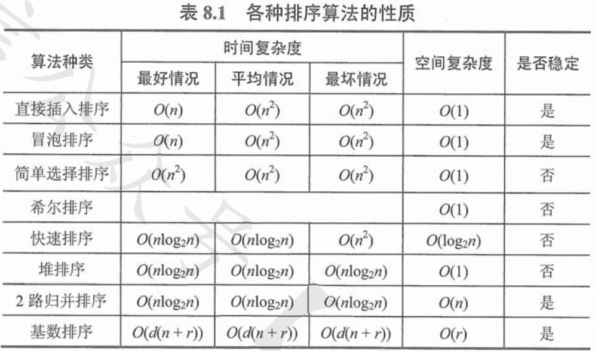
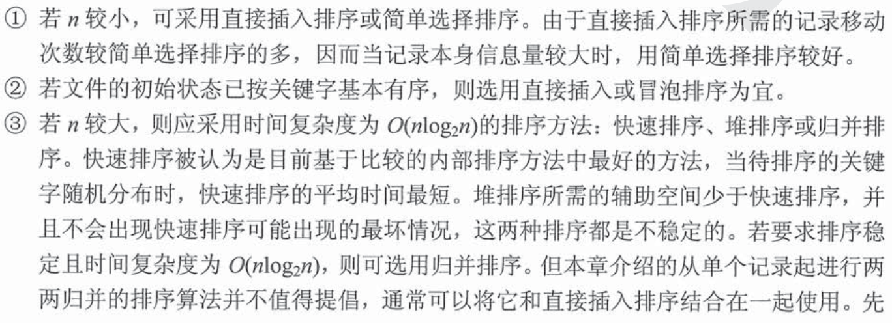
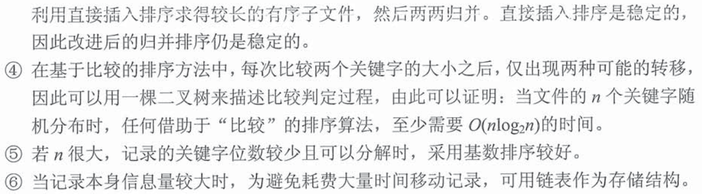

# 排序
## 内部排序
### 插入排序
  - **直接插入排序**  
    1. 思想：为了把某元素插入到已有的有序表L中，需要先在有序表L查找到要插入的位置k，之后把k+1到有序序列尾的元素全部后移一位，再在k位置填入要插入的元素
    2. 代码：
        ```cpp
        void InsertSort(ElemType A[], int n){
            int i,j;
            for(i=2; i<=n; i++){
                if(A[i]<A[i-1]){    //如果当前操作元素小于前一个
                    A[0]=A[i];      //更新监视哨
                    for(j=i-1; A[0]<A[j];--j){  //从后向前查找应该存放的位置
                        A[j+1]=A[j];    //按序向后挪动位置
                    }
                    A[j+1]=A[0];    //插入应该的位置
                }
            }
        }
        ```  
    3. 性质：  
       1. 空间效率$O(1)$
       2. 平均时间效率$O(n^2)$
       3. 稳定性：稳定
       4. 适用性：顺序存储和链式存储
  - **折半插入排序**  
    1. 思想：直接插入方式是边查找边移位。当要排序的序列是顺序储存时，把查找要插入的位置同元素移位操作分离开，用折半查找到位置再统一移位
    2. 代码：
        ```cpp
        void InsertSort(ElemType A[], int n){
            int i,j,low,high,mid;
            for(i=2; i<=n; i++){
                A[0]=A[i];
                low=1;high=i-1;
                while(low<=high){           //开始折半查找
                    mid=(low+high)/2;
                    if(A[mid]>A[0]){
                        high=mid-1;
                    }
                    else{
                        low=mid+1;
                    }
                }                           //折半查找结束
                for(j=i-1; j>=high+1; --j){ //以high为基准统一后移元素
                    A[j+1]=A[j];            
                }
                A[high+1]=A[0];             //插入
            }
        }
        ```  
    3. 性能：
       1. 与直接插入排序相同，但由于其折半查找的操作，故仅能用于顺序存储
   - **希尔排序**  
    1. 思想：将待排序列分割为若干形如$L[i, i+d, i+2d, \cdots, i+kd]$的子表，进行一次直接插入排序，当原序列大概成有序序列时，对整体进行一次直接插入排序
    2. 代码：
   ```cpp
    void ShellSort(ElemType A[], int n){
        for(dk=n/2; dk>=1; dk=dk/2){
            for(i=dk+1; i<=n; ++i){
                if(A[i]<A[i-dk]){
                    A[0]=A[i];
                    for(j=i-dk; j>0&&A[0]<A[j]; j-=dk){
                        A[j+dk]=A[0];
                    }
                    A[j+dk]=A[0];
                }
            }
        }   
    }
   ```  
   3. 性能：
      1. 空间复杂度：$O(1)$
      2. 时间复杂度：依赖于增量序列的函数，最坏情况下$O(n^2)$
      3. 稳定性：非稳定性
      4. 仅用于线性表为顺序存储情况
### 交换排序  
- 冒泡排序
  1. 思想：从后往前两两比较相邻元素的值，若为逆序即$A[i-1]<A[i]$，则交换这两个数的位置，直到序列比较完
  2. 代码：
```cpp
    void BubbleSort(ElemType A[], int n){
        for(i=0; i<n-1; i++){           //从0号单元开始冒泡
            flag=false;
            for(j=n-1; j>i; j--){       //从末尾向前开始一趟冒泡
                if(A[j-1]>A[j]){
                    swap(A[j-1], A[j]);
                    flag=true;
                }
            }
            if(flag==false){
                return;
            }
        }
    }
```
  3. 性能：
     1. 空间复杂度：$O(1)$
     2. 时间复杂度：平均情况、最坏情况下$O(n^2)$；最好情况下$O(n)$
     3. 稳定性：稳定
- 快速排序
  1. 思想：基于分治法，待排序序列任选一个值作为基准、枢轴（pivot），通过一趟排序使得小于基准的元素全部在左，大于的元素全部在右，这使得pivot元素放在了其最终应该在的位置上。递归地对左右半边使用这种排序，直到每个部分都只有一个元素或是空为止，排序完成
  2. 代码：
   ```cpp
    void QuickSort(ElemType A[], int low, int high){
        if(low<high){
            int pivotpos=Partition(A, low, high);   //以low为基准划分A为两个子列
            QuickSort(A, low, pivotpos-1);          //递归快排左子列
            QuickSort(A, pivotspos+1, high);        //递归快排右子列
        }
    }
    int Partition(ElemType A[],int low, int high){
        ElemType pivot=A[low];
        while(low<high){
            while(low<high&&A[high]>=pivot)         
                --high;                             
            A[low]=A[high];                         //比pivot大的调整至左子列
            while(low<high&&A[low]<=pivot)
                ++low;
            A[high]=A[low];                         //比pivot小的调整至右子列
        }
        A[low]=pivot;                               //pivot存放在最终应该在的位置
        return low;                                 //返回存放枢轴的最终位置
    }
   ```
   3. 性能：
      1. 空间：最好情况$O(log_2{n})$，最坏情况$O(n)$，**平均情况$O(log_2{n})$**
      2. 时间：最好情况、**平均情况$O(nlog_2{n})$**，最坏情况$O(n^2)$
      3. 不稳定算法
> **快排是排序算法中平均性能最优的算法**
### 选择排序  
- 直接选择排序
  1. 思想：假设排序表为L[1...n]，第i趟排序即从L[i...n]中选择关键字最小的元素与L(i)交换，**每一趟可以确定一个元素的最终位置**
- 堆排序
  1. 思想：借助堆这种数据结构进行排序
  2. 堆：大根堆：父节点的元素大于其左右孩子；小根堆：父节点的元素小于其左右孩子
  3. 过程：
       - 建堆：把无序数组写成完全二叉树形式，再从最后一个非叶结点开始挨个向前，调整二叉树使得其符合堆的要求，这个过程耗时$O(n)$
       - 排序：构建好堆后，堆顶元素就是最大/最小元素，此时把堆顶元素同数组中的最后一个元素交换位置，并不再参与堆；此时重新调整堆，即可得到次大/次小元素
### 归并排序和基数排序
- 归并排序  
    1. 思想：将两个两个以上的有序表组合成一个新的有序表；假设排序表有n个元素，可以视为n个有序的子表，两两归并，形成$\left \lceil n/2 \right \rceil$个子表，以此类推继续归并直到得到一个有序表为止
    2. 过程：两段有序表A1A2相邻存放在一起，先把他们复制到另一段内存B中，每次从B中的两段A1A2选择一个最小的元素，放入A；
- 基数排序
    1. 思想：基于关键字各位的大小进行排序；常有最高位优先和最低位优先两种方法
    2. 过程：重复“分配”——“收集”过程
### 内部排序算法比较

**这张图很重要**  
- 排序算法的选择：



## 外部排序
- 概念  
  外部排序指要排序的文件过大，无法一次全部装入内存，需要存放在外存的文件的排序
- 方法  
  1. 归并排序：把外存文件划分为一个个的小段，读入内存归并排序，形成初始归并段，接着把初始归并段再归并，需要注意每当归并完一个缓冲区大小的段，就必须立刻调入下一个缓冲区大小的段
    2. 归并趟数；$\left \lceil log_k{r} \right \rceil$，r个初始归并段，做k路归并
- 多路平衡归并与败者树
- 置换-选择排序  
  用于生成初始归并段的时候减少生成的初始归并段的数量
- 最佳归并树
  1. 思想：把置换-选择排序得到的长度不一的初始归并段组织起来，迁移哈夫曼树的思想，实现最小次数的磁盘IO；这需要最佳归并树
  2. 最佳归并树：一颗严格k叉树，如果结点不满足构成的要求，则需要添加度为0的虚节点
       - 判定添加虚节点的个数： 
        $$
       \begin{gathered}
           令u=(n_0-1)\%(k-1)，n_0=n\\
            若u\neq0，则需要添加空段，空归并段的个数：k-u-1\\
            否则不需要添加空段\\
       \end{gathered}
        $$