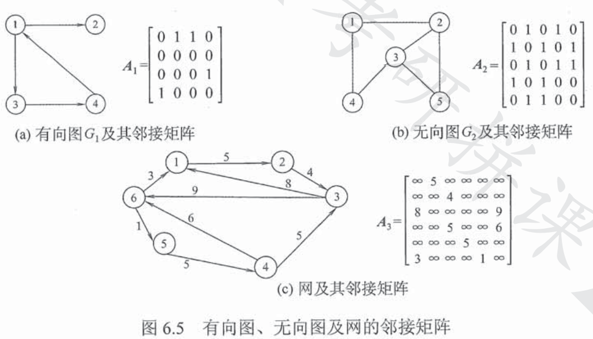
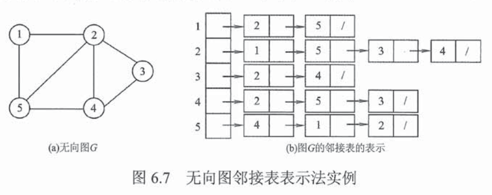
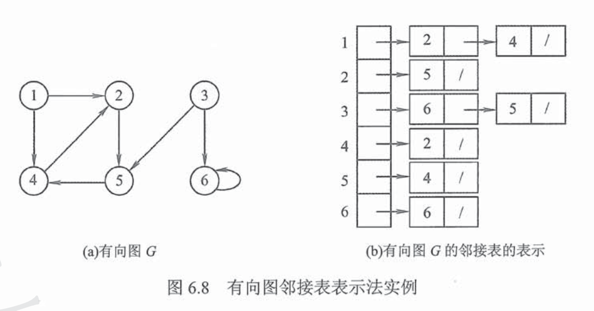
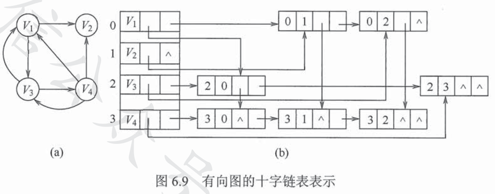
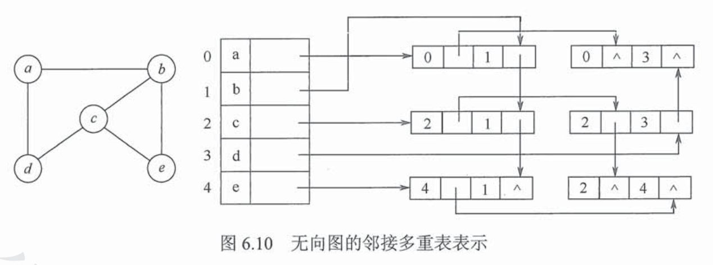

# 图的存储  
## 邻接矩阵法  
用一个一维数组存储顶点信息，用一个二维数组存储图中边的信息 

结点数为n的图，其邻接矩阵A是n×n的，A[i][j]表示顶点i和顶点j之间的边，有向图中A[i][j]与A[j][i]一般不同  

不带权的图：
$$A[i][j]=
\left\{\begin{matrix}
1,若 (v_i,v_j)或<v_i,v_j>是E(G)中的边\\
0,若 (v_i,v_j)或<v_i,v_j>不是E(G)中的边\\
\end{matrix}\right.
$$   
带权图：
$$A[i][j]=
\left\{\begin{matrix}
w_{ij},若 (v_i,v_j)或<v_i,v_j>是E(G)中的边\\
0或\infty,若 (v_i,v_j)或<v_i,v_j>不是E(G)中的边\\
\end{matrix}\right.
$$  

邻接矩阵法的存储结构定义
```cpp
#define MaxVertexNum 100
typedef char VertexType;
typedef int EdgeType;
typedef struct{
    VertexType Vex[MaxVertexNum];
    EdgeType Edge[MaxVertexNum][MaxVertexNum];
    int vexnum, arcnum;     //图的当前顶点数和弧数
}MGraph;
```  



## 邻接表法  
邻接表是指对每一个顶点建立一个单链表，第i个单链表中的结点代表了依附于顶点i的边（无向图），或是代表了以i为弧尾的边（有向图）  

```cpp
#define MaxVertexNum 100
typedef struct ArcNode{     //边表结点
    int adjvex;             //该弧指向的顶点的位置
    struct ArcNode *next;
    //InfoType info;     边权值
}ArcNode;
typedef struct VNode{       //顶点表结点
    VertexType data;
    ArcNode *first;
}VNode, AdjList[MaxVertexNum];
typedef struct{
    AdjList vertices;   //邻接表
    int vexnum,arcnum;  //图的顶点数和弧数
}ALGraph;
```


  

## 十字链表法  
> 用于有向图  

弧结点有5个域：
* tailvex, headvex指向弧头结点和弧尾结点
* hlink指向弧头相同的下一条弧
* tlink指向弧尾相同的下一条弧
* info包括了弧的相关信息  

顶点结点有3个域：
* data存放顶点有关信息
* firstin和firstout指向以该节点为弧头或弧尾的第一个弧结点  

  

## 邻接多重表  
> 用于无向图  

与十字链表类似，每个边和顶点都有顶点  

边结点：
* Mark标记是否被搜索过
* ivex指向该边依附的i结点位置
* jvex指向该边依附的j结点位置
* ilink指向下一条依附于i结点的边
* jlink指向下一条依附于j结点的边
* info表示边信息  

顶点结点：
* data代表顶点信息
* firstedge指向第一条依附于该顶点的边  

  

# 图的基本操作  
- Adjacent(G, x, y)
  - 判断图G是否存在边(x,y)或<x,y> 
- Neighbors(G, x)
  - 列出G中与结点x邻接的边
- InsertVertex(G, x)
  - 在G中插入顶点x
- DeleteVertex(G, x)
  - 在G中删除顶点x
- AddEdge(G, x, y)
  - 若G中不存在边(x,y)或<x,y>，则添加该边
- RemoveEdge(G, x, y)
  - 若G中存在边(x,y)或<x,y>，则删除该边
- FirstNeighbor(G, x)
  - 求G中顶点x的第一个邻接点，返回顶点号；出现错误则返回-1
- NextNeighbor(G, x, y)
  - 设y为x的一个邻接点，返回除y的下一个邻接点号；其他情况返回-1
- Get_edge_value(G, x, y)
  - 返回边(x,y)或<x,y>的权值
- Set_edge_value(G, x, y, v)
  - 设置边(x,y)或<x,y>的权值为v